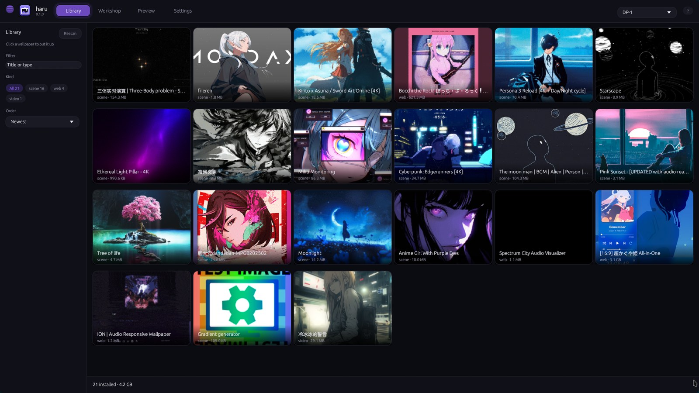
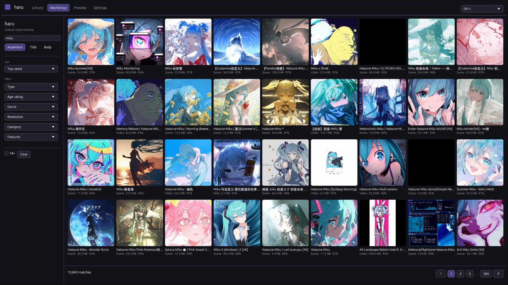
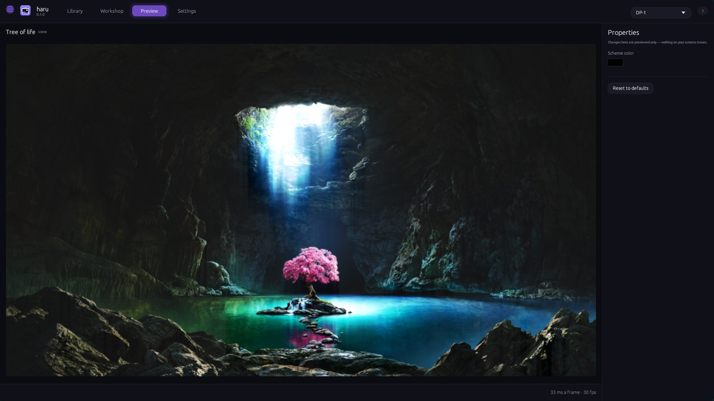

# haru

**Live wallpapers on Linux and macOS.** Browse the Wallpaper Engine Steam
Workshop, install what you like, and put it on your desktop — animated scenes,
looping video and interactive web wallpapers — with no Steam client running and
no Wallpaper Engine installed.

**You do need to own Wallpaper Engine on Steam.** Owning it is what lets Steam
hand over Workshop downloads and the shared assets scenes are drawn with; haru
signs in as you, once, to fetch them. What you do not need is the Steam client
running, Wallpaper Engine installed, or Windows.

haru draws them through [kirie](https://github.com/UnhingedSoftware/kirie),
which it fetches for you the first time you apply one. Browsing and installing
work anywhere haru builds; putting a wallpaper up needs kirie, which supports
Linux (Wayland and X11) and macOS.

貼る — "to put up".

```sh
haru                    # your wallpapers, and what is on each screen
haru workshop           # browse
haru --search miku      # browse, already searching
haru --item 884307090   # preview one, and edit its settings
```

| | |
|:-:|:-:|
| [](docs/shots/library.jpg)<br>**Library** — what is installed, and what is on each screen | [](docs/shots/workshop.jpg)<br>**Workshop** — 3.1M items, Steam's own filters, no Steam client |

[](docs/shots/preview.jpg)

**Preview** — the wallpaper rendered off-screen with its own properties beside
it, editable live. Nothing on your screens moves.

## What it does

- **Live wallpapers** — scenes, video and web wallpapers on your desktop,
  behind your icons, on every screen. Sizing, frame rate, volume, parallax and
  each wallpaper's own properties are yours to change while it runs.
- **Workshop** — search 3.1M items with Steam's own filters: tag groups, sort
  and period, content labels, date windows, numbered pages or endless scroll.
- **Library** — what is installed, what is on each screen, apply, delete, and
  the current wallpaper's own sliders and colours beside it.
- **Preview** — one wallpaper rendered off-screen with its settings editable
  live. Nothing on your screens moves.

## Requirements

**Browsing** the Workshop needs nothing at all — no account, no sign-in.

**Installing wallpapers** and **drawing scenes** need a Steam account that owns
Wallpaper Engine (app 431960). Steam only releases Workshop files and the
engine's shared assets to an account that owns it, so haru asks you to sign in
once — `tapline login --qr`, approved in the Steam mobile app. No password is
typed or stored; a refresh token is kept for you.

**Applying and previewing** need a renderer —
[kirie](https://github.com/UnhingedSoftware/kirie) — which haru fetches for
you. Scenes additionally need the shared assets above; video, image and web
wallpapers do not.

Wallpapers install to `<steam library>/steamapps/workshop/content/431960/<id>`,
where kirie, Wallpaper Engine and Steam already look.

## Installing on macOS

Open `haru-macos-aarch64.dmg` and drag haru into Applications, the usual way.

The first launch gets refused:

> "haru.app" Not Opened - Apple could not verify "haru.app" is free of malware...

Nothing is wrong with the app. These builds carry an ad-hoc signature only:
no Apple Developer ID, no notarization. Both of those need a paid Developer
Program membership and a scan of every build, so until that exists macOS files
haru under "downloaded, unverified". On macOS 15 the old right-click -> Open
trick is gone as well: the dialog offers **Move to Trash** or **Done**. Press
**Done**, then let it through one of these two ways.

**In System Settings.** Privacy & Security -> scroll down to Security -> next
to "haru.app was blocked to protect your Mac", press **Open Anyway** and
confirm with Touch ID or your password. Once is enough; later launches just
work.

**In a terminal.** Strip the quarantine flag macOS put on the download:

```sh
xattr -dr com.apple.quarantine /Applications/haru.app
open /Applications/haru.app
```

kirie wants the same if you downloaded its binary instead of building it:

```sh
xattr -d com.apple.quarantine ~/.local/bin/kirie
```

Anything you build yourself skips all of this. The flag only lands on
downloads.

## Build

```sh
cargo build --release        # target/release/haru
packaging/install.sh target/release/haru
```

`install.sh` puts the binary in `~/.local/bin` and the desktop entry and icons
in `~/.local/share`, so haru shows up in the application launcher. `PREFIX=/usr`
installs system-wide.

Needs [tapline](https://github.com/UnhingedSoftware/tapline) checked out beside
this repository.

## Layout

```
haru-core      filters, vocabulary, installed-wallpaper index, config
haru-workshop  tapline: browse, page, count, install
haru-media     preview art: fetch, decode, cache
haru-apply     renderer backends — the only crate that knows a platform
haru-ui        the window
haru           the binary
```

`haru-core` and `haru-workshop` depend on no UI and no backend, so a studio can
be added over the same crates rather than beside them.

MPL-2.0.
